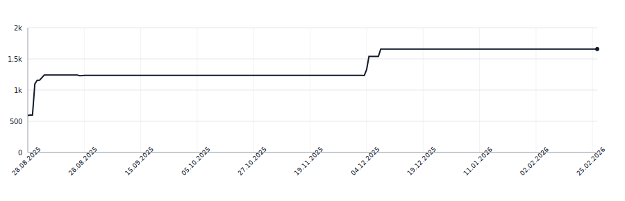

[](https://github.com/apakabarlabs/syllabreak-kotlin/actions/workflows/tests.yml)
# syllabreak-kotlin

Multilingual library for accurate and deterministic hyphenation and syllable counting without relying on dictionaries.

This is a Kotlin/JVM port of [syllabreak-python](https://github.com/apakabarlabs/syllabreak-python). Rules and tests are synced from there via `make sync-yaml`.

## Supported Languages

- 🇬🇧 English (`eng`)
- 🇷🇺 Russian (`rus`)
- 🇷🇸 Serbian Cyrillic (`srp-cyrl`)
- 🇷🇸 Serbian Latin (`srp-latn`)
- 🇧🇦 Bosnian (`bos`)
- 🇭🇷 Croatian (`hrv`)
- 🇲🇪 Montenegrin Latin (`cnr-latn`)
- 🇲🇪 Montenegrin Cyrillic (`cnr-cyrl`)
- 🇹🇷 Turkish (`tur`)
- 🇰🇿 Kazakh (`kaz`)
- 🇰🇬 Kyrgyz (`kir`)
- 🇬🇷 Modern Greek (`ell`)
- 🏛️ Ancient Greek (`grc`)
- 🇬🇪 Georgian (`kat`)
- 🇭🇺 Hungarian (`hun`)
- 🇩🇪 German (`deu`)
- 🇫🇷 French (`fra`)
- 🇷🇴 Romanian (`ron`)
- 🇪🇸 Spanish (`spa`)
- 🇵🇹 Portuguese (`por`)
- 🇵🇱 Polish (`pol`)
- 🇱🇻 Latvian (`lav`)
- 🇦🇲 Armenian (`hye`)
- 🇫🇮 Finnish (`fin`)
- 🇳🇱 Dutch (`nld`)
- 🏛️ Latin (`lat`)

## Why syllabification isn't trivial

A few language-specific quirks the algorithm has to encode. Each one would otherwise produce visibly wrong splits.

- **BCMS (bos, hrv, cnr)** — long-jat reflex `ije` is **one** syllable: `mli-je-ko` is wrong, `mlije-ko` is correct. Two graphic-but-not-jat exceptions are `dvije` and `prije` (Matešić 2015, rule P11). `srp-latn` does not encode `ije` because Serbian dictionaries cover both ekavian and ijekavian; pass `lang="hrv"` (or `bos`/`cnr-latn`) for ijekavian text.
- **Montenegrin** adds `ś`/`ź` (Latin) and `с́`/`з́` (Cyrillic, decomposed `с` + U+0301 only — no precomposed Unicode points exist).
- **French** — `eau` is a trigraph vowel: `châ-teau`.
- **Romanian** — final `-i` after a consonant is palatalization, not a separate syllable.
- **German** — `st` between vowels splits after a short nucleus but stays together after a long one.
- **Latin** — hiatus is mandatory.
- **Polish** — digraphs `sz`, `cz`, `rz`, `dz`, `ch` stay together.
- **Hungarian** — only one consonant moves to the next syllable, so even valid onset clusters split (`ab-lak`, not `a-blak`). Geminate digraphs (`ssz`, `ggy`, `nny`, `lly`, `tty`, `ccs`, `zzs`, `ddz`, `ddzs`) are written compactly and restored in full at the break per AkH 12 §226 (`asz-szony`, `meny-nyi`).
- **Turkic Cyrillic (kaz, kir)** — strict VC-CV: only one consonant moves to the next syllable, three-consonant clusters split 2|1. Kyrgyz long vowels (`аа`, `ээ`, `оо`, `ии`, `уу`, `өө`, `үү`) form a single nucleus (`буу-дай`).
- **Latvian** — V-CV/VC-CV with muta-cum-liquida kept (`la-brīt`). Diphthongs `ai`, `au`, `ei`, `ie`, `iu`, `oi`, `ui`, `eu`, `ou` form a single nucleus. Macron vowels are shared with Latin, so detection without a cedilla letter (`ļ`, `ķ`, `ģ`, `ņ`) keeps `lat` first.
- **Armenian** — strict V-CV/VC-CV (Oxford: "Word-internally, -CC- is perceived as a natural syllable boundary"). Three-consonant clusters split CC|C by the same default long-cluster rule used for Turkic/Hungarian-style strict VC-CV languages. No `clusters_keep_next`; native phonotactics disallow CCV- onsets. `ու` is a single vowel digraph; `և` (yev) counts as one vowel-bearing letter. Pronounced schwa between written consonants (`դպրոց` → [də.pə.rɔts]) is not orthographic.
- **Finnish** — strict V-CV/VC-CV per VISK §11–14 and Karlsson (1999). Long vowels and i/u/y-ending diphthongs are single nuclei in any position; opening diphthongs (`ie uo yö`) are formally root-initial only but treated as one nucleus everywhere. Any 3+ vowel sequence splits as hiatus. Auto-detect caveat: the Finnish alphabet is a subset of German's — pass `lang="fin"` explicitly.
- **Dutch** — strict V-CV for one consonant, VC-CV for two consonants (`kas-teel`, `mees-ter`, `pis-tool`). Muta-cum-liquida (`br bl dr fr fl gr gl kr kl pr pl tr vr wr`) stays together (`pa-troon`, `a-tri-um`). In 3+ consonant clusters, s-onsets and `tj`/`sch` also keep with the next syllable (`ven-ster`, `ham-ster`, `in-dus-trie`, `pad-den-stoel`) — encoded via a new `trailing_onsets` field that only applies in this position. `ch` is a single phoneme; vowel digraphs and triphthongs (`aai ooi oei eeu ieu`) are single nuclei. Hiatus marked by diaeresis (`idee-ën`, `pa-ti-ënt`). Auto-detect caveat: no unique characters relative to German — pass `lang="nld"` explicitly.
- **Modern Greek** — V-CV; consonant clusters keep with the following nucleus up to length 3 if they form a valid Greek onset (`βι-βλί-ο`, `ά-στρο`, `συ-γκρί-νω`). Identical doubled consonants always split (`ελ-λη-νι-κά`). Vowel digraphs αι/ει/οι/υι/αυ/ευ/ηυ/ου in all accent positions; consonant digraphs μπ/ντ/γκ/γγ/τζ/τσ as one consonant. Orthographic policy — synizesis is NOT applied.
- **BCMS** — syllabic `r` between consonants is a syllable nucleus: `prst` and `krv` are one syllable.
- **Georgian** — no digraphs; consonant sequences split unless on a small whitelist of valid onsets.

For BCMS specifically, character-based auto-detect cannot tell `bos`/`hrv`/`srp-latn`/`cnr-latn` apart for text without script-unique letters — the detector returns `srp-latn` first to preserve prior behaviour. Pass `lang=` explicitly to get ijekavian handling.

## Installation

Add the dependency to your `build.gradle.kts`:

```kotlin
dependencies {
    implementation("fm.apakabar:syllabreak-kotlin:0.10.0")
}
```

## Usage

### Auto-detect language

When no language is specified, the library automatically detects the most likely language:

```kotlin
import fm.apakabar.syllabreak.Syllabreak

val s = Syllabreak("-")
println(s.syllabify("hello"))        // "hel-lo"
println(s.syllabify("здраво"))       // "здра-во" (Serbian Cyrillic)
println(s.syllabify("привет"))       // "при-вет" (Russian)
```

### Specify language explicitly

You can specify the language code for more predictable results:

```kotlin
val s = Syllabreak("-")
println(s.syllabify("problem", "eng"))      // "pro-blem" (Force English rules)
println(s.syllabify("problem", "srp-latn")) // "prob-lem" (Force Serbian Latin rules)
println(s.syllabify("mlijeko", "hrv"))      // "mlije-ko" (Croatian ije is one syllable)
```

This is useful when:
- The text could match multiple languages
- You want consistent rules for a specific language
- Processing text in a known language

### Listing supported languages

```kotlin
val s = Syllabreak()
println(s.supportedLanguages())  // ["eng", "rus", "srp-cyrl", ...]
```

### Language detection

You can detect languages that match the input text:

```kotlin
val s = Syllabreak()
println(s.detectLanguage("hello"))   // ["eng"]
println(s.detectLanguage("здраво"))  // ["srp-cyrl"]
println(s.detectLanguage("привет"))  // ["rus"]
```

### Custom soft hyphen

By default, the library uses the Unicode soft hyphen (`­`), but you can customize it:

```kotlin
val s = Syllabreak("|")  // Use pipe as separator
println(s.syllabify("syllabification"))  // "syl|la|bi|fi|ca|tion"
```

## Out of Scope

Some writing systems do not fit syllabreak's alphabetic-rules paradigm and will not be added — they need fundamentally different algorithms:

- **Chinese, Japanese, Korean** — logographic / mora-syllabic / Hangul-block-based; no vowel/consonant rule engine applies.
- **Arabic** — abjad; short vowels are optional diacritics, so syllabification is undecidable without vocalization.
- **Bengali, Hindi, Sanskrit** — Brahmic abugidas; the unit is the akṣara, which requires Unicode grapheme-cluster logic rather than a flat character table.

## Lines of Code

<picture>
  <source media="(prefers-color-scheme: dark)" srcset=".github/loc-history-dark.svg">
  <source media="(prefers-color-scheme: light)" srcset=".github/loc-history-light.svg">
  
</picture>
